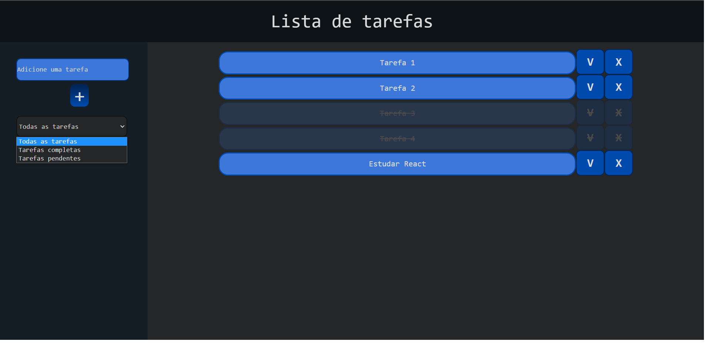

<h1>Lista de tarefas</h1>

 Projeto solicitado para entrevista de emprego.

 Foi um desafio e tanto, mas como o tempo que eu tive disponível para desenvolver foi pouco (estudo no turno da manhã e trabalho nos turnos tarde/noite) não consegui fazer tudo o que foi solicitado.

 Meu principal problema foi o redux, nunca tinha utilizado ele e por mais que tenha estudado bastante sobre nesses dias do projeto entendi ele na teoria, mas não consegui aplicar e manter o projeto rodando. Estou enviando sem uso do redux.

 Outro problema sério que tive foi manter os dados na local storage após reiniciar a página da aplicação, preciso me aprofundar mais nesses conceitos. Mais informações nos comentários do código APP.js.

 Sei que não entreguei um ótimo trabalho, mas dei meu melhor, o básico está funcional e responsivo. Estudo programação há pouco mais de 4 meses e o React tem sido um desafio muito prazeroso, por mais que eu ainda tenha muito para aprender.

 Se leu até aqui agradeço imensamente, se tiver feedbacks para dar ficarei feliz. 
  Meus contatos estão na minha página inicial do github.

<h4> Obrigado!</h4>

